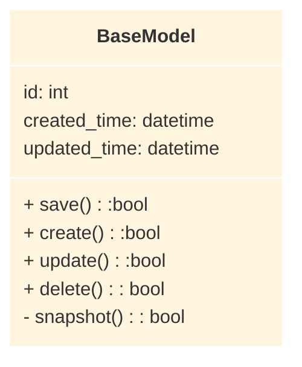
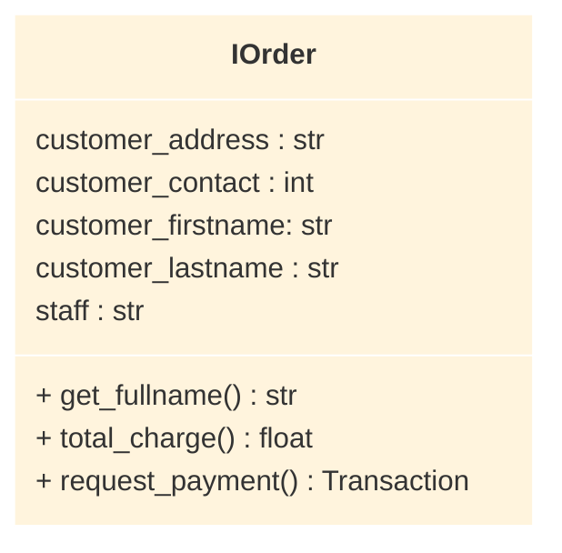
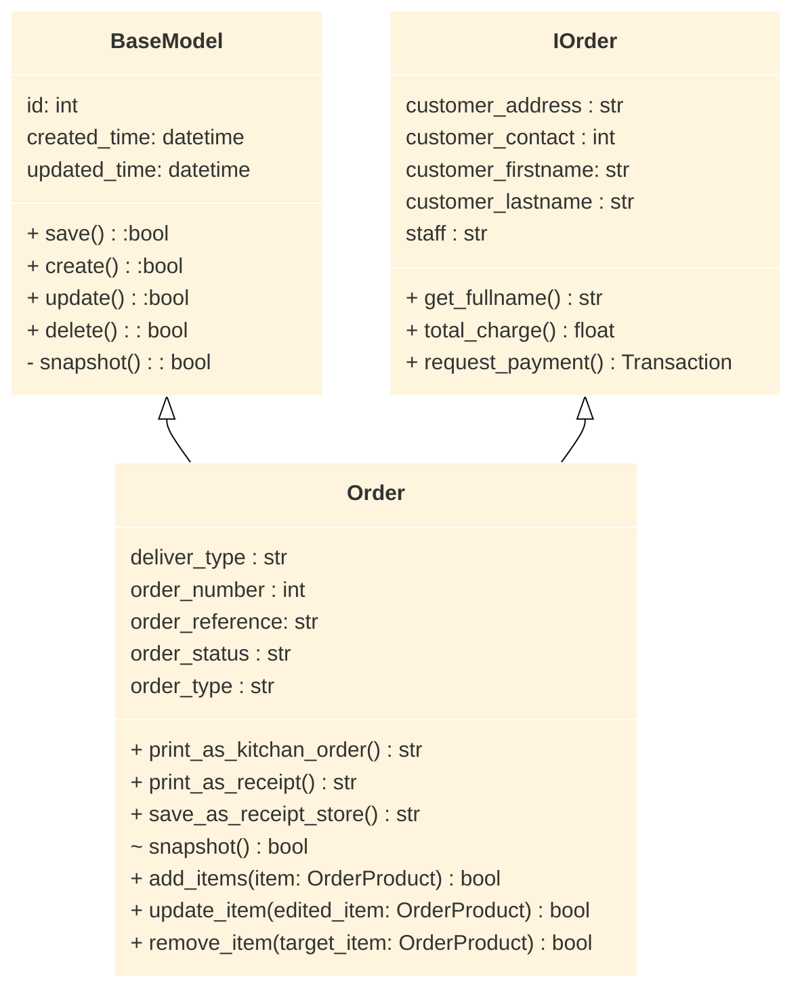
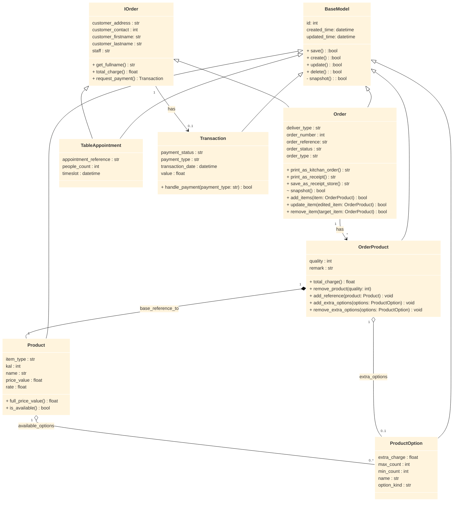
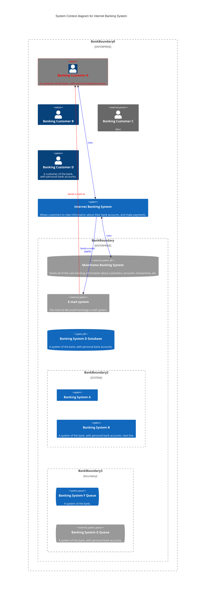

::: block
# UTS 32555 
## Fundation of Sofeware Dvelopment
::: 
// @[Homan Cheng (2458)](homan.cheng@student.uts.edu.au)

---

# Basic Concept for whole system 
## with oop design

--

# class diagram

```mermaid

%%{
  init: {
    'theme':'base',
     'themeVariables': {
        'primaryBorderColor': '#ffffff',
        'secondaryBorderColor': '#ffffff',
        'tertiaryBorderColor': '#ffffff',
        'noteBorderColor': '#ffffff',
        'nodeBorder' : '#ffffffff'
     }
  }
}%%

classDiagram

  class BaseModel {
    id: int 
    created_time: datetime
    updated_time: datetime
    + save():bool
    + create():bool
    + update():bool
    + delete(): bool
    - snapshot(): bool
  }
  class IOrder {
    customer_address : str
    customer_contact : int
    customer_firstname: str
    customer_lastname : str
    + get_fullname() str
    staff : str
    + total_charge() float
    + request_payment() Transaction
  }
  class Order {
    deliver_type : str
    order_number : int
    order_reference: str
    order_status : str
    order_type : str
    + print_as_kitchan_order() str
    + print_as_receipt() str
    + save_as_receipt_store() str
    ~ snapshot() bool
    + add_items(item: OrderProduct) bool
    + update_item(edited_item: OrderProduct) bool
    + remove_item(target_item: OrderProduct) bool
  }
  
  class OrderProduct {
    quality : int
    remark : str
    + total_charge() float
    + remove_product(quality: int)
    + add_reference(product: Product) void
    + add_extra_options(options: ProductOption) void
    + remove_extra_options(options: ProductOption) void
  }
  class Product {
    item_type : str
    kal : int
    name : str
    price_value : float
    rate : float
    + full_price_value() float
    + is_available() bool
  }
  class ProductOption {
    extra_charge : float
    max_count : int
    min_count : int
    name : str
    option_kind : str
  }
  class TableAppointment {
    appointment_reference : str
    people_count : int
    timeslot : datetime
  }
  class Transaction {
    payment_status : str
    payment_type : str
    transaction_date : datetime
    value : float
    + handle_payment(payment_type: str) bool
  }

```

<!-- .slide: data-transition="slide" data-background="#4d7e65" data-background-transition="zoom" -->


--


::: {.container}
:::: {.col}

::::
:::: {.col}

### Base Model
- should have methods for data Read/Write (CRUD)
- should have a 
  - identifier
  - created date
  - updated data

::::
:::

--


::: {.container}
:::: {.col}

::::
:::: {.col}

### Order Interface Model (iorder)

- should have these Attrubites
  - customer related information (`address`, `contact`, `firstname`, `lastname`)
  - staff in charge
  - payment related method
  - transaction related
  - should able to print out receipt

::::
:::

--

### Impletment example (Order Model) 

:::{.container}

::::{.col}



::::


::::{.col.text-right}
- it should be inherited in multiple based, instead of inherect layer in layer
- 


::::

:::

--



---

:::{data-auto-animation}
## in real Estate ##

# Do it ORM way
:::


--




---

## Code 
## Base Model

```python{data-trim data-background-transition="zoom" data-line-numbers="3-5|7-15"}

import ormar

class BaseModel(ormar.Model):
    """Model for DBO base model, for inhert."""
    class Meta(BaseMeta):
        abstract = True
        tablename = "base_model"

    id: int = ormar.Integer(primary_key=True, autoincrement=True)
    created_date: datetime = ormar.DateTime(
        autoincrement=True,
        default=datetime.now
    )
    updated_date: datetime = ormar.DateTime(
        autoincrement=True,
        default=datetime.now,
    )


@ormar.pre_update(BaseModel)
async def before_update(sender, instance, **kwargs):
    instance.updated_date = datetime.now

```

---

# vscode-reveal

 Awesome VS code extension using The HTML Presentation Framework Revealjs

<small>Created by [Vincent B.](https://www.evilznet.com) / [@Evilznet](https://twitter.com/Evilznet)</small>

---

## Hello There

reveal.js enables you to create beautiful interactive slide decks using HTML. This presentation will show you examples of what it can do.

---

## Vertical Slides

Slides can be nested inside of each other.

Use the _Space_ key to navigate through all slides.

<a href="#" class="navigate-down">
    
</a>

--

## Basement Level 1

Nested slides are useful for adding additional detail underneath a high level horizontal slide.

--

## Basement Level 2

That's it, time to go back up.

<a href="#/2">
    
</a>

---

## Point of View

Press **ESC** to enter the slide overview.

Hold down alt and click on any element to zoom in on it using [zoom.js](http://lab.hakim.se/zoom-js). Alt + click anywhere to zoom back out.

> Use ctrl + click in Linux

---

## Touch Optimized

Presentations look great on touch devices, like mobile phones and tablets. Simply swipe through your slides.

---

<!-- .slide: style="text-align: left;" -->
# THE END

- [Try the online editor](http://slides.com)
- [Source code & documentation](https://github.com/hakimel/reveal.js)