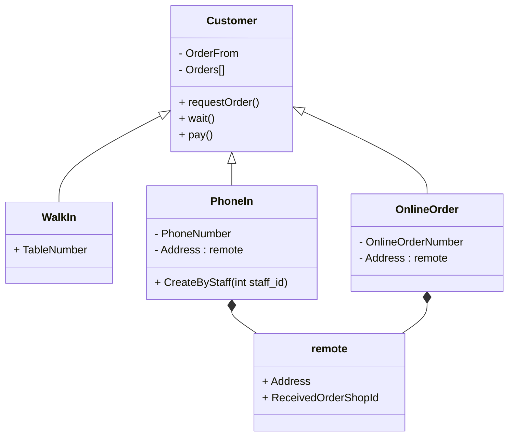

# Use Case Description 

# Actors

## Customer
-   request the order
-   pay the order

### Work-in
-   direct order to Front-counter staff
-   complete the payment in 

### Phone-in 
-   order via the phone call

### Online-order
-   order via the online platform / apps

## Staff 
-   \<\<include>> Front counter staff
-   \<\<include>> Host 
-   \<\<include>> Kitchen staff
-   \<\<include>> Delivery Staff

### Front counter staff
-   meet and interact with customer 
-   interface to customer
-   input customer's order to system
-   handle customer's payment 

### Host 
-   Deliver food from kitchen to deck
-   Table service 

### Kitchen Staff
-   Create meal product
-   prepare meal for menu
-   report when meal item is sold out

### Delivery Staff
-   Deliver the meal product to call-in customer
-   receive pao

# Related Item / Object

## Order
- status : Incomplete / Complete Payment 
- Payment : cash / by debit and credit card. 

## Large Group Booking
- min: 6 ppl ~ max: 20 ppl
- prepay : $100
- deduct from final payment
- no refund if cancal 
- 15% discount for meal order

## Normal Table Booking 
- max: 6/4 ppl
- online / phone 

## Menu

## Pizza
- size option : Small (8 Inch)/ Large (11 Inch) / Extra Large (12 Inch)
- base option : traditional/ wholemeal / gluten free bases
- sause option : tomato sauce / BBQ sauce
- topping option :  supreme / sausage sizzle / Hawaiian / chicken / veggie lovers’
- subtype option : 
  -  chicken pizza : sweet chilli chicken / periperi chicken. 
  -  veggie lovers’ pizza : garden goodness / vegan cheese. 
> remark : 
>    displays the calorie intake of each item, 
>    key ingredients and the price. 

## add-on / side
- side option : pasta / chicken wings / garlic bread / drinks. 
- pasta option : creamy mushroom pasta / classic Bolognese pasta
- drinks option : soft drinks / fruit juices

## receipt

## good sold data

## Inventory data

## Discount 
- student-card : 10% off
- membership : using a loyalty card, 7 meals order get 1 free

## Membership
- create via online 
- create membership : 
  + name, 
  + mail,
  + mobile-phone 
  + appropriate password

# Use Case 

// last read l47 , group table